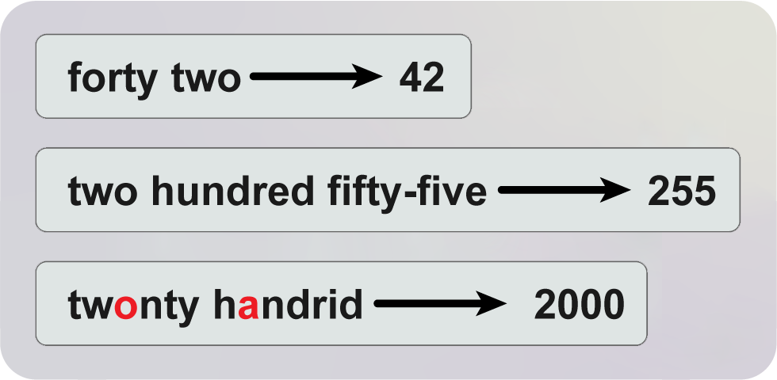
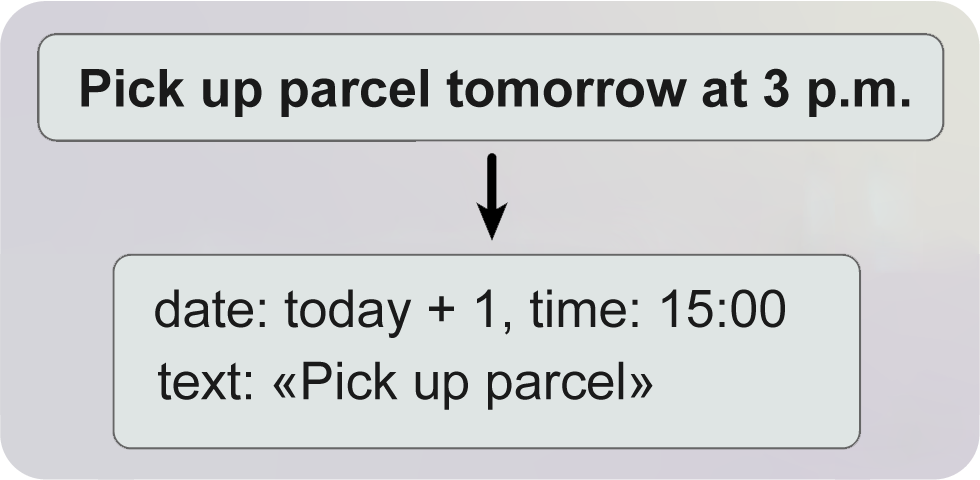
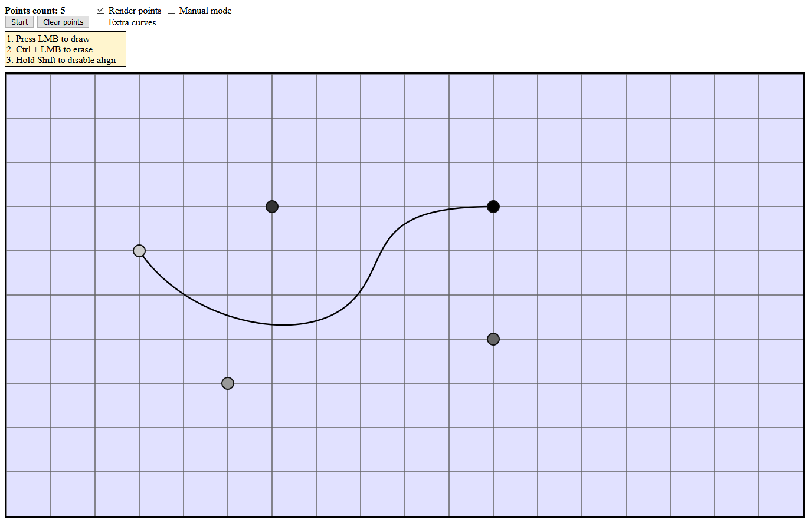
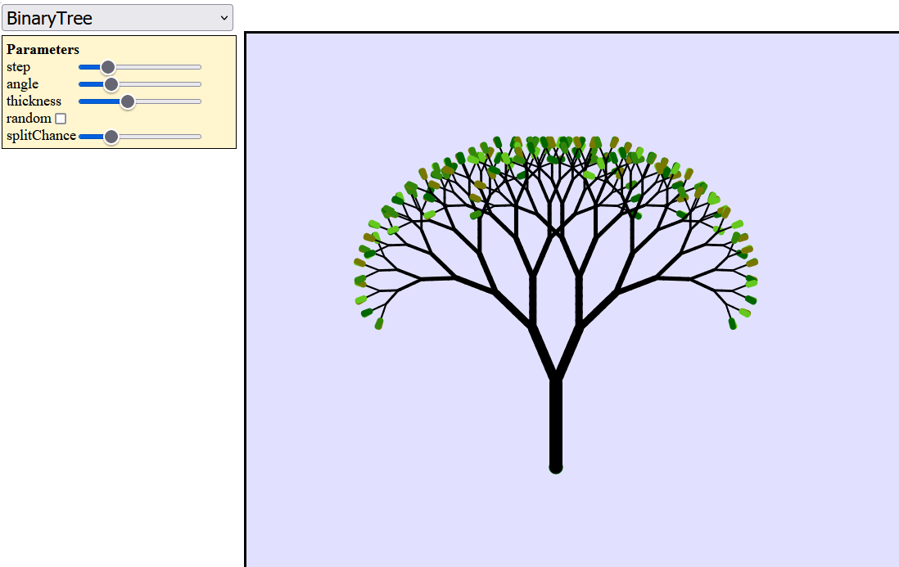
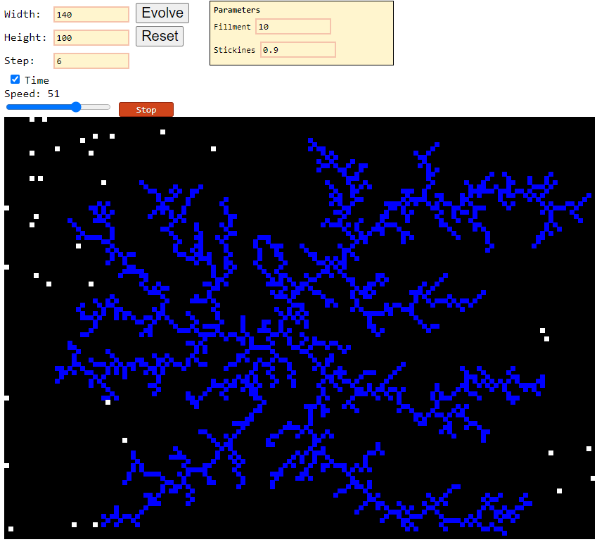
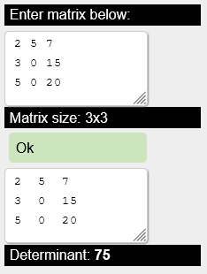

## JS

### 1. **[parse-word-to-number](https://github.com/alordash/parse-word-to-number)**

Converts words to corresponding numbers.  

##### Library perceives misspellings.

### 2. **[date-parser](https://github.com/alordash/date-parser)**

Extracts date infromation from natural speech.  

##### Library perceives misspellings.

### 3. **[Smart Scheduler](https://github.com/alordash/BotSmartScheduler)**

Telegram bot that implements features provided by [parse-word-to-number](https://github.com/alordash/parse-word-to-number) and [date-parser](https://github.com/alordash/date-parser).  
Hence creates reminders.  

## Drawings

### 1. **[Bezier curves](https://github.com/alordash/BezierCurve)**
Draws arbitrary bezier curves.  
[>>Click<<](https://alordash.github.io/BezierCurve/Code/static/index.html) to open in your browser.  

### 2. **[L-systems](https://github.com/alordash/L-Systems)**
Draws various L-systems.  
[>>Click<<](https://alordash.github.io/L-Systems/static/index.html) to open in your browser.  

### 3. **[Maze generator](https://github.com/alordash/MazeGeneration)**
Draws mazes.  
[>>Click<<](https://alordash.github.io/MazeGeneration/static/index.html) to open in your browser.  

### 4. **[Diffusion limited aggregation](https://github.com/alordash/DLA)**
Simulates DLA.  
[>>Click<<](https://alordash.github.io/DLA/static/index.html) to open in your browser.  

## Static web sites

### **[Matrix determinant calculator](https://github.com/alordash/MatrixDeterminant)**

Runtime [matrix determinant](https://en.wikipedia.org/wiki/Determinant) calculator.

### [>>Click<<](https://alordash.github.io/MatrixDeterminant/publish/wwwroot/) to open in your browser.  

<!--
**alordash/alordash** is a ✨ _special_ ✨ repository because its `README.md` (this file) appears on your GitHub profile.

Here are some ideas to get you started:

- 🔭 I’m currently working on ...
- 🌱 I’m currently learning ...
- 👯 I’m looking to collaborate on ...
- 🤔 I’m looking for help with ...
- 💬 Ask me about ...
- 📫 How to reach me: ...
- 😄 Pronouns: ...
- ⚡ Fun fact: ...
-->
